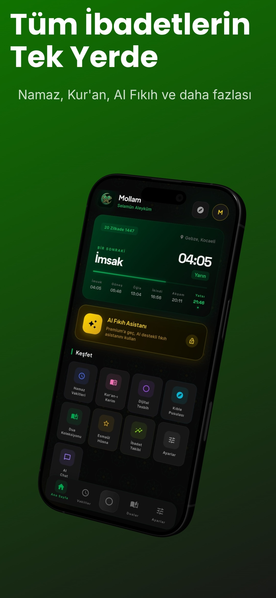
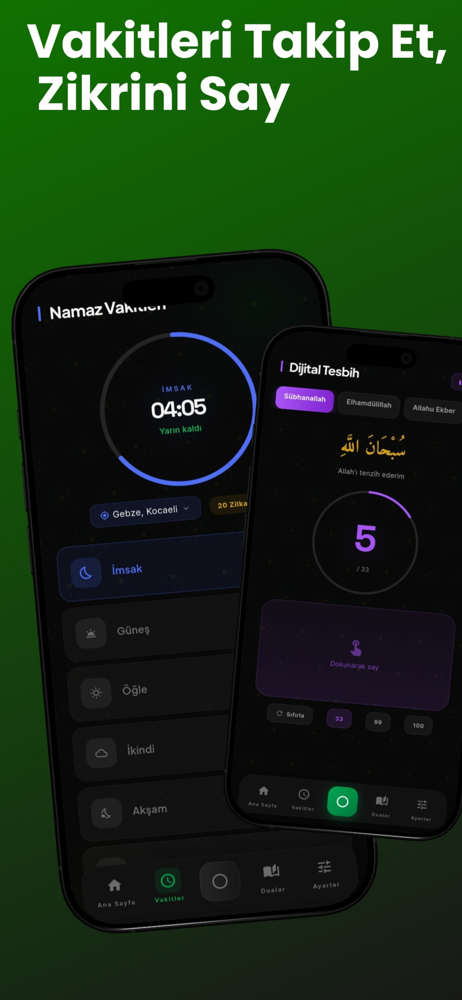
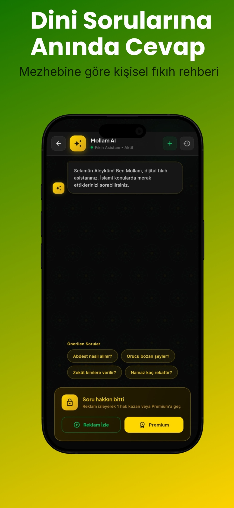
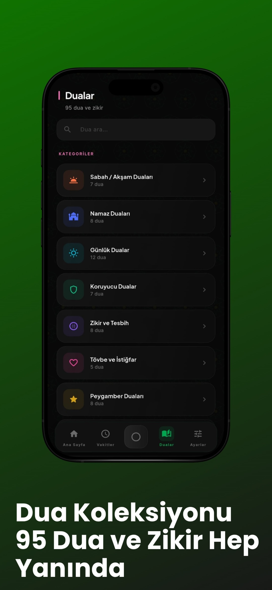
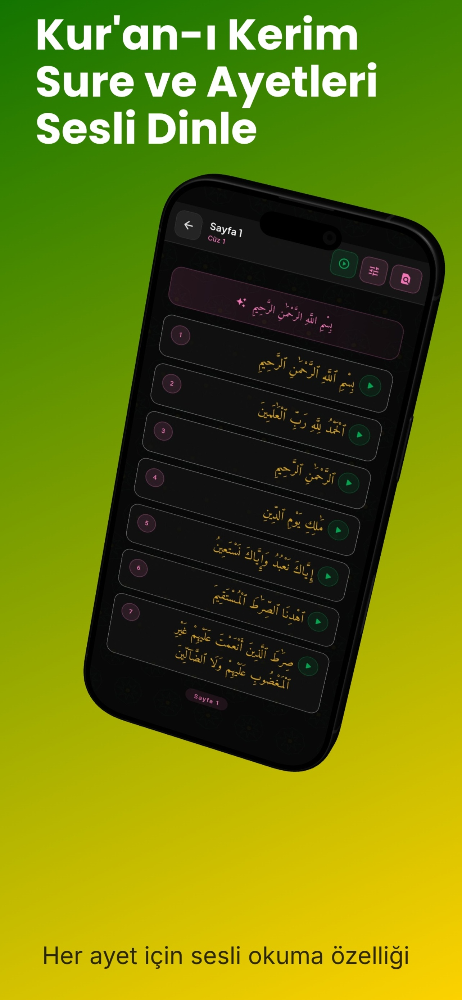
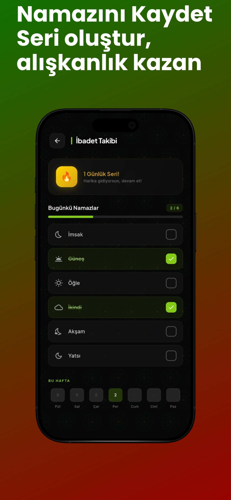

# 🕌 Mollam — Modern İslami Asistan

> Yapay zekâ destekli, Flutter tabanlı İslami yardımcı uygulama. Namaz, Kur'an, AI fıkıh asistanı ve daha fazlası tek yerde.

---

## 📖 Hakkında

Mollam, dini sorulara anlık ve güvenilir cevaplar sunan yapay zekâ destekli İslami asistan uygulamasıdır. Namaz vakitlerinden Kur'an-ı Kerim'in sesli okunuşuna, dijital tesbihten yapay zekâ destekli fıkıh asistanına kadar günlük ibadet için gereken araçları tek uygulamada toplar.

## ✨ Özellikler

- 🤖 **AI Fıkıh Asistanı** — Dini sorulara hızlı ve güvenilir, mezhebe göre kişiselleştirilmiş yanıtlar
- 🕐 **Namaz Vakitleri** — Konuma göre günlük vakit takibi ve geri sayım
- 📖 **Sesli Kur'an-ı Kerim** — Tüm sureler ayet bazında sesli dinleme
- 📿 **Zikirmatik (Dijital Tesbih)** — Sübhanallah, Elhamdülillah, Allahu Ekber sayaçları (33/99/100)
- 🧭 **Kıble Pusulası** — Bulunduğun konumdan anlık kıble yönü
- 🔥 **İbadet Takibi** — Namaz kaydı, seri (streak) ve haftalık alışkanlık takibi
- 🤲 **95+ Dua** — Türkçe okunuş ve anlamlarıyla, kategorilere ayrılmış
- ⭐ **Esmaül Hüsna** — Allah'ın 99 ismi
- 🕋 **Mezhep Seçimi** — Hanefi, Şafii, Maliki, Hanbeli desteği

## 📱 Ekran Görüntüleri

| Ana Sayfa | AI Fıkıh Asistanı | İbadet Takibi |
|---|---|---|
|  |  |  |

| Kur'an-ı Kerim | Vakitler & Tesbih | Dualar |
|---|---|---|
|  |  |  |

## 🛠️ Teknoloji Stack

- **Framework:** Flutter (Dart)
- **Abonelik Yönetimi:** RevenueCat
- **Reklam:** Google AdMob
- **CI/CD:** Codemagic (cloud iOS build)
- **Kimlik Doğrulama:** Sign in with Apple, Google Sign-In

## 📦 Uygulama Bilgileri

| | |
|---|---|
| **Platform** | iOS 15.0+ (iPhone, iPad) |
| **Kategori** | Referans |
| **Boyut** | ~87 MB |
| **Güncel Sürüm** | 1.1.1 |
| **Web** | [ottovate.com.tr](https://www.ottovate.com.tr/) |
| **Gizlilik** | [Gizlilik Politikası](https://mollam.com.tr/privacy-policy.html) |

## 📌 Not

Bu repo uygulamanın tanıtım amaçlı vitrinidir; kaynak kod kapalıdır.

## 👤 Geliştirici

**Burak Özdemir** — [App Store](https://apps.apple.com/tr/developer/burak-ozdemir/id1896532113) · [GitHub](https://github.com/Burakmakend) · [LinkedIn](https://www.linkedin.com/in/burakozdemir42/)

**Muhammed Efe Özdemir**

**Melih Ödev**

© 2026 Burak Özdemir
